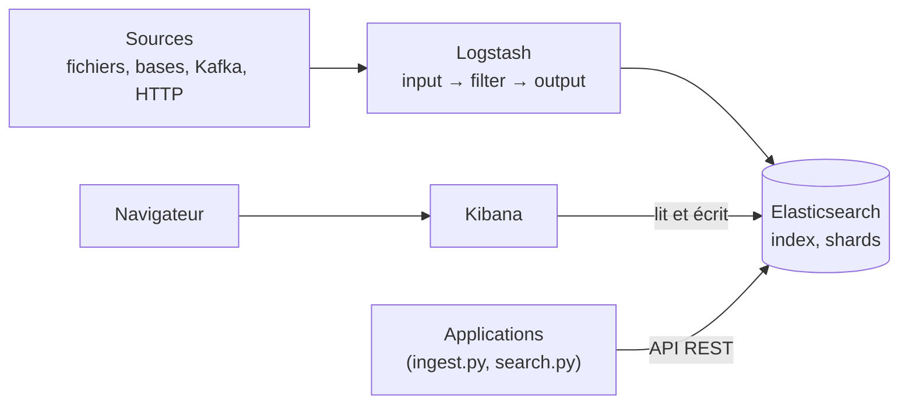
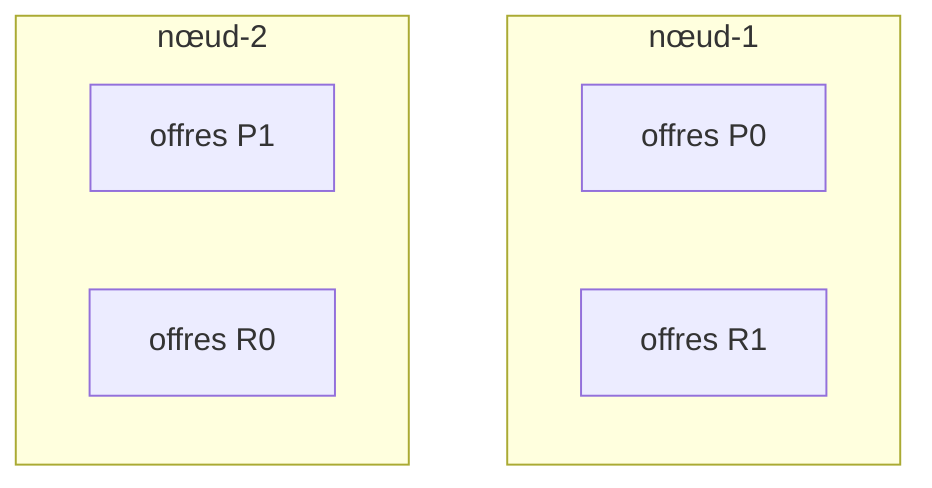
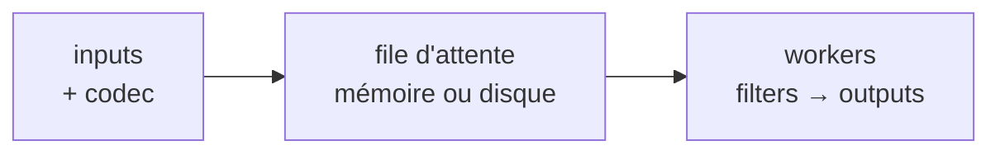

# La stack ELK : support de cours

**Public :** EISI Data. **Durée :** ½ journée à 1 jour. **Version de référence :** Stack Elastic 9.5.4 (Elasticsearch, Kibana, Logstash).
**Prérequis :** avoir déjà vu **Python** (les TP font écrire et exécuter des scripts Python) ; avoir réalisé le TP1 (index `offres`, `ingest.py`, `search.py`).

Le module se déroule en trois étapes :

| Étape | Contenu | Durée indicative |
| --- | --- | --- |
| 1. [TP1 : introduction à Elasticsearch](TP1%20-%20Introduction/Readme.md) | Première prise en main : Elasticsearch et Kibana en Docker, mapping, recherche, agrégations, ingestion en Python | 1 jour environ |
| 2. Ce cours | Reprise et approfondissement des notions du TP1, puis présentation de Logstash | ½ journée à 1 jour |
| 3. [TP2 : Logstash](TP2%20-%20Logstash/Readme.md) | Ingestion et analyse de logs avec Logstash, enquête et tableau de bord dans Kibana | 1 jour environ |

Le module commence par le TP1, où l'on découvre la stack en pratique, et se termine par le TP2. Ce cours reprend et approfondit les notions vues dans le TP1, puis présente Logstash, utilisé dans le TP2. Les renvois "TP1, ex. x.y" et "TP2, ex. x.y" désignent les exercices de chaque TP.

## Sommaire

1. [La stack ELK](#1-la-stack-elk)
2. [Le modèle de données d'Elasticsearch](#2-le-modèle-de-données-delasticsearch)
3. [Dialoguer avec Elasticsearch : l'API REST](#3-dialoguer-avec-elasticsearch--lapi-rest)
4. [Le cluster : nœuds, shards, répliques](#4-le-cluster--nœuds-shards-répliques)
5. [Écrire : du document au segment](#5-écrire--du-document-au-segment)
6. [Indexer du texte : analyseurs et index inversé](#6-indexer-du-texte--analyseurs-et-index-inversé)
7. [Le mapping](#7-le-mapping)
8. [Ingérer en masse](#8-ingérer-en-masse)
9. [Rechercher](#9-rechercher)
10. [Agréger](#10-agréger)
11. [ES|QL](#11-esql)
12. [Kibana](#12-kibana)
13. [Des offres aux logs : un autre problème d'ingestion](#13-des-offres-aux-logs--un-autre-problème-dingestion)
14. [Logstash](#14-logstash)
15. [Index ou data stream](#15-index-ou-data-stream)
16. [Pour aller plus loin : exploiter la stack](#16-pour-aller-plus-loin--exploiter-la-stack)
17. [Glossaire complémentaire](#17-glossaire-complémentaire)
18. [Auto-évaluation](#18-auto-évaluation)
19. [Sources](#19-sources)

---

## 1. La stack ELK

### 1.1 Le problème à résoudre

Deux besoins très différents mènent à la même famille d'outils :

- **Chercher dans des données métier** : proposer une barre de recherche tolérante (fautes de frappe, pluriels, pertinence) sur un catalogue, des offres d'emploi, des articles. C'est le cas du TP1.
- **Analyser des événements** : une application répartie sur des dizaines de serveurs produit des journaux (logs) hétérogènes. Pour répondre à "pourquoi le site renvoie des erreurs depuis 14 h ?", il faut centraliser ces événements, les structurer, les rechercher et les visualiser. Se connecter à chaque machine pour lancer `grep` ne fonctionne plus à cette échelle : on n'a ni vue d'ensemble, ni historique, ni graphique. C'est le cas du TP2, qui enquête sur un incident à partir des logs d'accès du site de recrutement.

### 1.2 Les trois briques

| Lettre | Brique | Rôle | Port |
| --- | --- | --- | --- |
| **E** | Elasticsearch | Stocke les documents JSON, les indexe, répond aux recherches et aux agrégations | 9200 |
| **L** | Logstash | Collecte des événements depuis des sources variées, les transforme, les envoie vers une ou plusieurs destinations | 9600 (API de supervision) |
| **K** | Kibana | Interface web : exploration, visualisation, tableaux de bord, administration | 5601 |



Dans le TP1, seuls **E** et **K** sont utilisés : l'ingestion est faite par un script Python (`ingest.py`). Le **L** est l'objet du TP2, qui ajoute un service Logstash à la même stack Docker.

### 1.3 Historique et nom

| Année | Événement |
| --- | --- |
| 2010 | Première version d'Elasticsearch (Shay Banon), construite sur la bibliothèque Apache Lucene |
| 2012 | Création de la société Elasticsearch BV |
| 2013 | Logstash (Jordan Sissel) et Kibana (Rashid Khan) rejoignent le projet : l'acronyme "ELK" apparaît |
| 2015 | Arrivée des Beats (agents de collecte légers) ; la société prend le nom Elastic |
| 2016 | Version 5.0 : les versions de toutes les briques sont alignées, l'ensemble prend le nom "Elastic Stack" |
| 2021 | Changement de licence à partir de la 7.11 ; AWS lance le fork OpenSearch |
| 2024 | Ajout de l'AGPLv3 comme option de licence pour Elasticsearch et Kibana |
| 2025 | Version 9.0 |

Toutes les briques d'une installation doivent avoir **la même version** (9.5.4 dans nos TP).

### 1.4 Licences

- Le code source d'Elasticsearch et de Kibana est disponible, au choix, sous **AGPLv3**, **SSPL 1.0** ou **Elastic License 2.0**. Les binaires distribués par Elastic relèvent de l'Elastic License.
- Les **clients** (Python, Java…) sont sous licence Apache 2.0.
- Les fonctionnalités sont réparties par niveau de souscription. Le niveau gratuit **Basic** couvre tout ce qui est utilisé dans nos TP : sécurité, Discover, Lens, ES|QL, Logstash, gestion du cycle de vie.
- **OpenSearch** est un fork Apache 2.0 d'Elasticsearch 7.10, aujourd'hui gouverné par une fondation de la Linux Foundation. Ses API ont divergé depuis 2021 : un client ou une requête écrits pour l'un ne fonctionnent pas toujours sur l'autre.

### 1.5 Usages adaptés et inadaptés

**Adapté :** recherche plein texte et pertinence, filtres et facettes sur de gros volumes, analyse de logs et de métriques, détection d'incidents de sécurité (SIEM), recherche vectorielle et hybride.

**Inadapté comme source de vérité :** pas de transactions multi-documents, mises à jour coûteuses, visibilité différée des écritures (section 5). On y place en général une **copie** indexée de données dont la référence est ailleurs (base relationnelle, MongoDB, fichiers).

---

## 2. Le modèle de données d'Elasticsearch

### 2.1 Document, champ, index

- Un **document** est un objet JSON. C'est l'unité stockée et renvoyée par les recherches.
- Un **champ** est une paire clé/valeur du document. Il peut être simple (`"ville": "Lyon"`), un tableau (`"competences": ["SIEM", "Python"]`) ou un objet (`"localisation": {"lat": …, "lon": …}`).
- Un **index** regroupe des documents de même nature qui partagent un **mapping** (le schéma, section 7).

| Elasticsearch | MongoDB | SQL |
| --- | --- | --- |
| Index | Collection | Table |
| Document | Document | Ligne |
| Champ | Champ | Colonne |
| Mapping | Validator (optionnel) | `CREATE TABLE` |
| Query DSL, ES\|QL | MQL | SQL |

### 2.2 Métadonnées d'un document

Chaque document renvoyé est accompagné de champs techniques (TP1, ex. 1.2) :

| Métadonnée | Signification |
| --- | --- |
| `_index` | Index qui contient le document |
| `_id` | Identifiant unique dans l'index, fourni par le client ou généré |
| `_version` | Compteur d'écritures du document, incrémenté à chaque modification |
| `_seq_no`, `_primary_term` | Numéro d'ordre de l'opération ; sert au contrôle de concurrence optimiste (`if_seq_no`) |
| `_source` | Le JSON d'origine, restitué tel quel |
| `_score` | Pertinence du document pour la recherche (section 9) |

`_source` est le document **tel qu'envoyé**. La recherche ne lit pas `_source` : elle utilise les **structures d'index** construites à partir de lui (index inversé, colonnes), et ces structures dépendent du mapping.

### 2.3 Les index système

`GET _cat/indices?v&expand_wildcards=all` (TP1, ex. 1.1) montre des index dont le nom commence par un point (`.kibana…`, `.security…`). Ce sont des index **système** : Kibana y range ses objets (data views, tableaux de bord), la sécurité y range utilisateurs et rôles. On ne les modifie jamais directement.

---

## 3. Dialoguer avec Elasticsearch : l'API REST

### 3.1 Anatomie d'une requête

Toute interaction est une requête HTTP. Au format de la console Kibana :

```text
GET offres/_search
{ "query": { "match": { "description": "agile" } } }
```

| Élément | Exemple | Rôle |
| --- | --- | --- |
| Méthode | `GET`, `PUT`, `POST`, `DELETE` | Lire, créer ou remplacer, déclencher une action, supprimer |
| Chemin | `offres/_search` | Ressource visée, puis API ; les API commencent par `_` |
| Paramètres | `?v`, `?pretty`, `?format=txt` | Options d'affichage ou de comportement |
| Corps | JSON | Contenu de la requête |

Codes de réponse courants : `200` succès, `201` créé, `400` requête invalide (erreur de syntaxe, de mapping), `401` non authentifié, `403` authentifié mais non autorisé, `404` introuvable, `409` conflit de version, `429` cluster surchargé (réessayer plus tard).

### 3.2 Un même langage, plusieurs outils

| Outil | Usage | Authentification |
| --- | --- | --- |
| Kibana Dev Tools | Mise au point, autocomplétion | Session Kibana |
| curl | Scripts, exploitation | `-u utilisateur:mot_de_passe` |
| Hoppscotch, Postman | Tests d'API, collections | Basic Auth |
| Clients officiels (Python…) | Applications, automatisation | Paramètres du client (`basic_auth`, `api_key`) |

Kibana ne redemande pas le mot de passe (TP1, ex. 0) : la session est authentifiée une fois, puis Kibana relaie les requêtes vers Elasticsearch **au nom de l'utilisateur connecté**, avec ses droits.

---

## 4. Le cluster : nœuds, shards, répliques

### 4.1 Vocabulaire

- **Nœud** : une instance d'Elasticsearch (un processus Java, ici un conteneur).
- **Cluster** : l'ensemble des nœuds qui partagent le même nom de cluster et coopèrent.
- **Shard** : un morceau d'index. Chaque shard est un index Lucene complet et autonome. Un index est découpé en **shards primaires**.
- **Réplique** : une copie d'un shard primaire, placée sur un **autre** nœud que son primaire.



Un index `offres` avec 2 primaires et 1 réplique compte 4 shards. Si `nœud-1` tombe, `R0` est promu primaire et une nouvelle réplique est reconstruite dès qu'un nœud est disponible.

### 4.2 Nombre de primaires et de répliques

| Réglage | Défaut | Modifiable ? |
| --- | --- | --- |
| `number_of_shards` (primaires) | 1 | Non : fixé à la création. Il faut `_split`, `_shrink` ou une réindexation |
| `number_of_replicas` | 1 | Oui, à chaud (`PUT index/_settings`) |

Le nombre de primaires est figé parce qu'un document est rangé dans le shard `hash(_routing) % nombre_de_primaires` (section 5.1). Changer ce nombre déplacerait tous les documents existants.

Les répliques ont deux usages : **tolérance aux pannes** et **répartition de la lecture** (une recherche peut être servie par une réplique).

### 4.3 Rôles des nœuds

| Rôle | Responsabilité |
| --- | --- |
| `master` | Éligible à la gestion de l'état du cluster : création d'index, mappings, allocation des shards |
| `data`, `data_hot`, `data_warm`, `data_cold`, `data_frozen` | Stocke les shards ; les *tiers* séparent les données récentes (matériel rapide) des anciennes (matériel économique) |
| `ingest` | Exécute les *ingest pipelines* (transformations avant indexation) |
| `ml`, `transform` | Apprentissage automatique, transformations continues |
| aucun rôle | Nœud coordinateur : reçoit les requêtes, les distribue, fusionne les réponses |

En production, on prévoit au moins **trois nœuds éligibles `master`**, pour qu'une majorité (quorum) puisse toujours élire un maître. Dans les deux TP, un nœud unique cumule tous les rôles.

### 4.4 La santé du cluster

| Couleur | Signification | Exemple |
| --- | --- | --- |
| Vert | Tous les shards, primaires et répliques, sont alloués | TP1 : index créé avec 0 réplique |
| Jaune | Tous les primaires sont alloués, mais des répliques ne le sont pas | Nœud unique avec `number_of_replicas: 1` : une réplique ne peut pas être sur le même nœud que son primaire |
| Rouge | Au moins un shard primaire n'est pas alloué : des données sont indisponibles | Perte d'un nœud sans réplique |

Commandes de diagnostic :

```text
GET _cluster/health
GET _cat/nodes?v
GET _cat/shards/offres?v
GET _cluster/allocation/explain
```

`_cluster/allocation/explain` répond à la question "pourquoi ce shard n'est-il pas alloué ?". C'est la première commande à lancer quand le cluster est jaune ou rouge.

---

## 5. Écrire : du document au segment

### 5.1 Le chemin d'une écriture

1. Le client envoie le document à un nœud quelconque, qui joue le rôle de **coordinateur**.
2. Le coordinateur calcule le shard cible : `shard = hash(_routing) % nombre_de_primaires`, où `_routing` vaut `_id` par défaut.
3. Le **shard primaire** écrit le document, puis transmet l'opération à ses **répliques**.
4. Quand les copies ont confirmé, le client reçoit la réponse.

### 5.2 Ce qui se passe dans un shard

| Étape | Mécanisme | Effet |
| --- | --- | --- |
| Écriture | Le document entre dans un **tampon mémoire** et dans le **translog** (journal sur disque) | Durable : le translog permet de rejouer les opérations après un crash |
| Refresh | Le tampon est transformé en **segment** Lucene (toutes les 1 s par défaut) | Le document devient **cherchable** |
| Flush | Commit Lucene : les segments sont écrits durablement, le translog est vidé | Redémarrage plus rapide |
| Merge | Les petits segments sont fusionnés en arrière-plan | Moins de segments, suppressions purgées |

C'est l'origine du **quasi temps réel** : un document est lisible par `GET index/_doc/<id>` immédiatement, mais n'apparaît dans une recherche qu'après le refresh suivant. D'où l'appel explicite à `_refresh` après une ingestion en masse (TP1, ex. 2.1) avant de compter. Un refresh a un coût : on ne le force pas à chaque écriture en production.

### 5.3 Segments immuables : mises à jour et suppressions

Un segment n'est jamais modifié. Conséquences :

- une **mise à jour** (`_update`, TP1, ex. 1.2) est en réalité une suppression logique de l'ancienne version plus l'écriture d'une nouvelle ;
- une **suppression** marque le document comme supprimé ; il disparaît physiquement lors d'un merge.

Elasticsearch convient donc mieux aux données écrites puis lues (logs, catalogues) qu'aux données modifiées en permanence.

### 5.4 Versions et concurrence

`_version` augmente à chaque écriture du même `_id` (TP1, ex. 1.2). Pour éviter qu'une écriture n'en écrase une autre faite entre-temps, on peut conditionner l'écriture :

```text
PUT offres/_doc/OFF-00002?if_seq_no=12&if_primary_term=1
{ ... }
```

Si le document a changé depuis la lecture, Elasticsearch répond `409 Conflict`.

---

## 6. Indexer du texte : analyseurs et index inversé

### 6.1 L'index inversé

Pour chaque champ `text`, Elasticsearch construit un **index inversé** : pour chaque terme, la liste des documents qui le contiennent (et les positions). Le principe est celui de l'index à la fin d'un livre.

| Terme | Documents |
| --- | --- |
| `python` | OFF-00012, OFF-00345, OFF-01022, … |
| `kubernetes` | OFF-00087, OFF-00345, … |

Chercher un mot revient à lire une entrée de cet index, au lieu de parcourir tous les documents.

### 6.2 L'analyseur

Les termes de l'index inversé sont produits par un **analyseur**, en trois étapes :

1. **Filtres de caractères** (facultatifs) : nettoyer le texte brut (supprimer du HTML, remplacer des caractères).
2. **Tokenizer** : découper en mots (*tokens*).
3. **Filtres de tokens** : mettre en minuscules, supprimer les mots vides, retirer les élisions (`l'`, `d'`), réduire à la racine (*racinisation*).

| Analyseur | Ce qu'il fait | Effet sur le français |
| --- | --- | --- |
| `standard` (défaut) | Découpage Unicode, minuscules | "l'analyse" reste un seul token ; "donnée" et "données" restent différents |
| `french` | + élision, mots vides français, racinisation | "l'analyse" donne un token sans "l'" ; "donnée" et "données" partagent la même racine |
| `keyword` | Aucun découpage | Toute la valeur est un seul terme |

L'API `_analyze` (TP1, ex. 3.1) montre les tokens produits :

```text
POST _analyze
{ "analyzer": "french", "text": "Les développeuses travaillaient sur l'analyse des données" }
```

### 6.3 Le même analyseur à l'indexation et à la recherche

> L'analyseur est appliqué **deux fois** : à l'indexation du document et à l'analyse de la question. Une recherche trouve un document quand les tokens de la question retrouvent ceux du document.

Cela explique les résultats de l'exercice 3.2 du TP1 :

- `match` sur `description` : la question "projets bancaires" est analysée comme le texte indexé, donc elle trouve ses tokens.
- `term` sur `ville` avec `"paris"` : `term` **n'analyse pas** la question. Le champ `ville` est un `keyword` qui contient "Paris" avec une majuscule : aucune correspondance.
- `term` sur `titre` avec `"Data Engineer Senior"` : `titre` est un `text` ; son index contient des tokens analysés (`data`, `engineer`, `senior`, éventuellement racinisés), jamais la phrase entière. Il faut viser le sous-champ `titre.brut` (`keyword`).

---

## 7. Le mapping

### 7.1 Rôle

Le mapping associe à chaque champ un **type**, qui décide des structures construites et donc des opérations possibles.

| Type | Structure construite | Opérations |
| --- | --- | --- |
| `text` | Index inversé des tokens analysés | Recherche plein texte, score. Ni tri ni agrégation |
| `keyword` | Index des valeurs exactes + **doc values** (stockage en colonnes) | Filtre exact, tri, agrégation |
| `integer`, `long`, `float`, `scaled_float` | Structure numérique + doc values | Intervalles, tri, statistiques |
| `date` | Nombre de millisecondes (UTC) + doc values | Intervalles de dates, histogrammes |
| `boolean` | Valeurs `true`/`false` | Filtre |
| `geo_point` | Structure spatiale | Distance, zones, cartes |

Les **doc values** sont une copie du champ organisée par colonne (document → valeur). Elles servent au tri et aux agrégations. Les champs `text` n'en ont pas : c'est pourquoi une agrégation `terms` sur `titre` échoue (TP1, ex. 4.1) et qu'il faut viser `titre.brut`.

### 7.2 Mapping dynamique

Sans mapping déclaré, Elasticsearch **déduit** le type du premier document reçu (TP1, ex. 1.3) :

| Valeur JSON reçue | Type déduit |
| --- | --- |
| `"45000"` (chaîne) | `text` avec un sous-champ `keyword` |
| `"2026-08-02"` (chaîne au format date) | `date` |
| `"true"` (chaîne) | `text` avec un sous-champ `keyword` |
| `52000` (nombre) | `long` |
| `true` (booléen) | `boolean` |

Pièges :

- une fois le type fixé, il ne change plus : un `salaire` déduit en `text` se trie comme du texte ("100000" avant "45000") ;
- le document suivant `{"salaire": 52000}` est **accepté** car le nombre est converti en chaîne pour entrer dans le champ `text` : l'erreur passe inaperçue ;
- une faute de frappe dans un nom de champ crée un nouveau champ silencieusement.

### 7.3 Mapping explicite et mode strict

On déclare le mapping à la création de l'index (TP1, ex. 1.4) et on le verrouille avec `"dynamic": "strict"`. Tout champ inconnu provoque alors une erreur `strict_dynamic_mapping_exception` (code 400) au lieu d'être accepté silencieusement. Dans le TP2, l'index `offres` refuse ainsi les champs que Logstash ajoute de lui-même (ex. 1.2) ; on les supprime ensuite dans le pipeline (ex. 1.3, section 14.5).

| Valeur de `dynamic` | Champ inconnu |
| --- | --- |
| `true` (défaut) | Ajouté au mapping, type déduit |
| `false` | Conservé dans `_source`, mais ni indexé ni cherchable |
| `strict` | Document rejeté |
| `runtime` | Ajouté comme champ calculé à la lecture |

### 7.4 Sous-champs (multi-fields)

Un même champ peut être indexé de plusieurs façons :

```json
"titre": {
  "type": "text",
  "analyzer": "french",
  "fields": { "brut": { "type": "keyword" } }
}
```

`titre` sert à la recherche, `titre.brut` au tri, aux facettes et aux filtres exacts. Le document n'est envoyé qu'une fois ; c'est Elasticsearch qui alimente les deux structures.

### 7.5 Changer un mapping

On peut **ajouter** un champ à un mapping existant, mais pas **changer le type** d'un champ existant. Procédure : créer un nouvel index avec le bon mapping, copier les données avec `_reindex`, puis basculer les applications (idéalement via un alias qui pointe vers l'index courant).

---

## 8. Ingérer en masse

### 8.1 L'API `_bulk`

Indexer 5 000 documents un par un coûte 5 000 allers-retours HTTP. L'API `_bulk` regroupe les opérations dans une seule requête au format NDJSON : une ligne d'action, puis une ligne de document.

```text
POST _bulk
{ "index": { "_index": "offres", "_id": "OFF-00001" } }
{ "id": "OFF-00001", "titre": "Développeur Java (Alternance)", "ville": "Paris" }
{ "index": { "_index": "offres", "_id": "OFF-00002" } }
{ "id": "OFF-00002", "titre": "Analyste Cybersécurité Senior", "ville": "Paris" }
```

| Action | Effet si l'`_id` existe déjà |
| --- | --- |
| `index` | Remplace le document |
| `create` | Échec (`409`) |
| `update` | Fusionne les champs fournis |
| `delete` | Supprime |

La réponse contient un statut **par opération** : un document rejeté n'annule pas les autres (TP1, ex. 2.3). Il faut donc toujours lire la réponse, ce que fait `helpers.bulk(..., raise_on_error=False)` en renvoyant la liste des erreurs.

Taille des lots : quelques milliers de documents ou quelques Mo par requête est un bon point de départ ; on ajuste en mesurant.

### 8.2 Idempotence

Une ingestion **idempotente** peut être relancée sans créer de doublons. Pour cela, on fixe `_id` à partir d'un identifiant métier (`id` de l'offre). Relancer `ingest.py` sans `--reset` (TP1, ex. 2.2) remplace alors chaque document au lieu d'en ajouter un second ; seul `_version` augmente. Avec des `_id` générés par Elasticsearch, chaque relance doublerait l'index.

Le principe est le même avec Logstash : dans le TP2, relancer le pipeline `offres` laisse 5 000 documents et fait seulement augmenter `_version` (ex. 1.3 et 1.4). Les logs d'accès, eux, n'ont pas d'identifiant métier : les rejouer crée des doublons (ex. 3.5).

### 8.3 Lire sans tout charger

`lire_actions()` est un **générateur** Python (`yield`) : le fichier est lu ligne à ligne et les actions produites à la demande. La mémoire consommée ne dépend pas de la taille du fichier. Logstash fonctionne de la même façon : il traite les données comme un **flux**.

### 8.4 Limites du script d'ingestion

`ingest.py` convient à un fichier propre, déjà au format JSON, chargé une fois. Il atteint ses limites quand :

- les données arrivent **en continu** (un fichier de log qui grossit) et qu'il faut reprendre là où on s'était arrêté après un redémarrage ;
- elles sont **non structurées** (une ligne de texte à découper en champs) ;
- elles viennent de **plusieurs sources** (fichiers, base SQL, file de messages) et vont vers **plusieurs destinations** ;
- il faut **absorber des pics**, réessayer en cas d'indisponibilité, isoler les documents en erreur.

Logstash répond à ces besoins (section 14). La partie 1 du TP2 remplace `ingest.py` par un pipeline Logstash, avec le même résultat attendu : 5 000 documents dans `offres`, sans doublon.

---

## 9. Rechercher

### 9.1 Contexte requête et contexte filtre

| | Contexte requête | Contexte filtre |
| --- | --- | --- |
| Question posée | "À quel point ce document correspond-il ?" | "Correspond-il, oui ou non ?" |
| Score | Calculé | Aucun |
| Cache | Non | Oui, réutilisable entre requêtes |
| Usage | Texte libre saisi par l'utilisateur | Critères exacts : ville, contrat, intervalle de salaire |

### 9.2 Familles de requêtes

| Requête | Champ visé | Comportement |
| --- | --- | --- |
| `match` | `text` | Analyse la question, cherche ses tokens (OU par défaut, `"operator": "and"` pour exiger tous les termes) |
| `multi_match` | plusieurs `text` | `match` sur plusieurs champs, pondération `titre^3` |
| `match_phrase` | `text` | Tokens dans l'ordre et adjacents |
| `term`, `terms` | `keyword`, nombre, date | Valeur exacte, sans analyse |
| `ids` | `_id` | Documents dont l'`_id` figure dans une liste |
| `range` | nombre, date | `gt`, `gte`, `lt`, `lte` |
| `exists` | tous | Le champ est présent |
| `geo_distance` | `geo_point` | Distance maximale à un point |
| `bool` | Sans objet | Combine des requêtes |

`terms` et `ids` permettent aussi de croiser deux sources. Dans le TP2 (ex. 4.4), on retrouve en une seule requête, dans l'index `offres`, les offres les plus consultées d'après les logs.

### 9.3 La requête `bool`

| Clause | Obligatoire ? | Contribue au score ? |
| --- | --- | --- |
| `must` | Oui | Oui |
| `filter` | Oui | Non |
| `should` | Non si `must` ou `filter` est présent : c'est un bonus | Oui |
| `must_not` | Exclusion | Non |

On place les critères exacts dans `filter` plutôt que dans `must` (TP1, ex. 3.4) pour deux raisons : ils ne doivent pas influencer la pertinence (être à Lyon ne rend pas une offre "plus pertinente"), et les filtres sont mis en cache, donc plus rapides.

### 9.4 Le score BM25

Le score d'un document pour un terme augmente quand :

1. le terme apparaît **souvent dans le document** (avec un effet de saturation : 10 occurrences ne valent pas 10 fois 1) ;
2. le terme est **rare dans l'index** ("kubernetes" pèse plus que "équipe") ;
3. le **champ est court** (un mot dans un titre de 4 mots pèse plus que dans une description de 5 phrases).

Le score d'une requête combine les scores de ses clauses ; la pondération (`titre^3`) multiplie la contribution d'un champ. Un score n'a pas d'unité : il sert à **classer** les résultats d'une requête, pas à comparer deux requêtes.

### 9.5 Tolérance aux fautes

`"fuzziness": "AUTO"` accepte des termes à une distance d'édition (insertion, suppression, substitution, transposition) de la question : 0 modification pour 1 à 2 caractères, 1 pour 3 à 5 caractères, 2 au-delà. "kubernetis" retrouve ainsi "kubernetes" (TP1, ex. 3.3).

### 9.6 Géographie

Un champ `geo_point` permet de filtrer par distance (`geo_distance`) et de trier par proximité (`_geo_distance`), comme dans l'exercice 3.5 du TP1.

### 9.7 Pagination et surlignage

- `from` + `size` : simple, mais chaque shard doit produire `from + size` résultats que le coordinateur trie. D'où la limite `index.max_result_window` fixée à 10 000 par défaut.
- Au-delà : `search_after` avec un *point in time* (PIT), qui fige une vue cohérente de l'index pendant le parcours.
- `highlight` renvoie des extraits où les termes trouvés sont encadrés (`<em>`).
- `_source` peut être restreint aux champs utiles, ce qui allège la réponse.

### 9.8 Le chemin d'une recherche

1. **Phase query** : le coordinateur envoie la requête à une copie (primaire ou réplique) de chaque shard ; chaque shard renvoie les identifiants et scores de ses meilleurs résultats.
2. **Phase fetch** : le coordinateur fusionne et trie, puis récupère le `_source` des seuls documents à renvoyer.

Plus de shards signifie plus de parallélisme, mais aussi plus de résultats partiels à fusionner : l'optimum dépend du volume (section 16).

---

## 10. Agréger

### 10.1 Deux familles

| Famille | Rôle | Exemples | SQL |
| --- | --- | --- | --- |
| Regroupement (*bucket*) | Répartit les documents dans des paquets et les compte (`doc_count`) | `terms`, `range`, `date_histogram`, `histogram`, `filters` | `GROUP BY` |
| Métrique | Calcule une valeur sur un ensemble de documents | `avg`, `min`, `max`, `sum`, `stats`, `cardinality`, `percentiles` | `AVG()`, `COUNT(DISTINCT)` |

Les agrégations s'imbriquent : une métrique placée dans un regroupement est calculée pour chaque paquet (salaire moyen **par ville**, TP1, ex. 4.1).

### 10.2 Règles pratiques

- Les regroupements par valeur se font sur des champs `keyword`, numériques ou dates, jamais sur `text` (pas de doc values).
- Les agrégations portent sur les documents **sélectionnés par la requête** (TP1, ex. 4.4). Sans `query`, c'est tout l'index.
- `"size": 0` supprime la liste de résultats quand seules les statistiques comptent.
- `terms` renvoie 10 paquets par défaut (`size` pour en demander plus). Sur plusieurs shards, les comptes des paquets peu fréquents peuvent être approximatifs.
- Une métrique ignore les documents où le champ est **absent** : la moyenne des salaires ne porte que sur les 3 389 offres qui en ont un.
- `cardinality` (valeurs distinctes) est une **estimation** : très précise sous quelques milliers de valeurs, approchée au-delà.

Sur des logs, on croise souvent `date_histogram` et `terms` pour compter les requêtes par heure et par code HTTP. C'est ce qui permet de trouver le créneau de l'incident dans le TP2 (ex. 4.2), avec Lens ou ES|QL.

---

## 11. ES|QL

ES|QL (*Elasticsearch Query Language*), disponible en version stable depuis la 8.14, est un langage à **tubes** : chaque commande reçoit le tableau produit par la précédente.

```text
POST _query?format=txt
{
  "query": """
    FROM offres
    | WHERE salaire_min IS NOT NULL
    | STATS salaire_moyen = ROUND(AVG(salaire_min)), nb = COUNT(*) BY ville
    | SORT salaire_moyen DESC
    | LIMIT 5
  """
}
```

| Commande | Rôle |
| --- | --- |
| `FROM` | Source : index, data stream, motif (`logs-*`) |
| `WHERE` | Filtrer |
| `EVAL` | Calculer une nouvelle colonne |
| `STATS … BY` | Agréger par groupe |
| `SORT`, `LIMIT` | Trier, limiter (1 000 lignes par défaut si `LIMIT` est absent) |
| `KEEP`, `DROP`, `RENAME` | Choisir et renommer les colonnes |
| `DISSECT`, `GROK` | Découper un texte en colonnes à la lecture |

`BUCKET` regroupe les dates par tranche, comme `date_histogram`. Exemple tiré de l'enquête du TP2 (partie 4) :

```text
FROM logs-web-default
| WHERE http.response.status_code >= 500
| STATS erreurs = COUNT(*) BY heure = BUCKET(@timestamp, 1 hour)
| SORT erreurs DESC
| LIMIT 10
```

Trois langages coexistent donc :

| Langage | Où | Point fort |
| --- | --- | --- |
| Query DSL | API `_search`, clients | Recherche applicative, pertinence, contrôle fin |
| ES\|QL | API `_query`, Discover, Lens | Analyse, transformation, investigation |
| KQL | Barre de recherche de Kibana | Filtrer rapidement |

---

## 12. Kibana

### 12.1 Rôle et fonctionnement

Kibana est une application web (Node.js) qui ne stocke aucune donnée métier : tout est lu et écrit dans Elasticsearch. Ses propres objets (data views, visualisations, tableaux de bord) sont des *saved objects* rangés dans les index système `.kibana*`. Plusieurs instances peuvent donc fonctionner derrière un répartiteur de charge. Kibana se connecte à Elasticsearch avec le compte de service `kibana_system` (créé par le service `setup` du TP1).

### 12.2 Les principaux écrans

| Écran | Usage | Dans les TP |
| --- | --- | --- |
| Dev Tools | Console, Grok Debugger (mise au point des motifs `grok`), Search Profiler | Console : TP1 et TP2 ; Grok Debugger : TP2, ex. 3.2 |
| Discover | Parcourir, filtrer, investiguer (KQL ou ES\|QL) | TP1, ex. 2.4 ; enquête du TP2, partie 4 |
| Lens | Construire des visualisations par glisser-déposer | TP1, ex. 4.5 (facultatif) ; TP2, partie 5 |
| Dashboards | Assembler des visualisations qui partagent période et filtres | TP1, ex. 4.5 (facultatif) ; TP2, partie 5 |
| Maps | Cartographier des champs `geo_point` | TP2, partie 5 (offres par ville) |
| Alerts and rules | Surveiller une condition et déclencher une action | TP2, partie 5 (bonus) |
| Stack Management | Index, data views, utilisateurs et rôles, cycle de vie, sauvegardes | Data views : TP1, ex. 2.4 ; TP2, partie 4 |

### 12.3 Data view

Une **data view** indique à Kibana quels index interroger (`offres`, `logs-web-*`) et quel champ sert d'axe temporel (`date_publication`, `@timestamp`). Sans champ temporel, pas de sélecteur de période ni d'histogramme dans Discover. Attention : la période par défaut ("Last 15 minutes") n'affiche rien si les données sont plus anciennes ; d'où l'élargissement à "Last 1 year" dans le TP1 (ex. 2.4). Dans le TP2 (partie 4), les logs couvrent une semaine précise : on choisit des dates **absolues** dans le sélecteur de période. Kibana affiche les heures dans le fuseau du navigateur, alors qu'Elasticsearch les stocke en UTC.

### 12.4 KQL

| Besoin | KQL |
| --- | --- |
| Égalité | `contrat : "CDI"` |
| Plusieurs valeurs | `ville : ("Lyon" or "Nantes")` |
| Intervalle | `salaire_min >= 50000` |
| Champ présent | `salaire_min : *` |
| Négation | `not teletravail : "aucun"` |
| Joker | `entreprise : Cév*` |
| Combinaison | `contrat : "CDI" and (ville : "Lyon" or salaire_min > 55000)` |

Sur les logs du TP2, les mêmes opérateurs s'appliquent aux champs nommés selon **ECS** (*Elastic Common Schema*, la convention de nommage des champs d'Elastic, section 14.5) : `http.response.status_code >= 500`, `source.address : "192.0.2.10"`, `http.request.method : "POST"`.

KQL sert seulement à **filtrer** : il ne calcule ni agrégat ni nouvelle colonne. Pour cela, on utilise Lens ou ES|QL dans Discover.

### 12.5 Visualiser

Lens propose un type de graphique selon les champs glissés :

| Question | Visualisation |
| --- | --- |
| Évolution dans le temps | Barres ou aires, axe temporel |
| Répartition | Barres, *treemap*, anneau |
| Chiffre clé | Indicateur (*metric*) |
| Classement | Tableau des valeurs les plus fréquentes |
| Position | Maps |

Dans un tableau de bord, un clic sur un élément ajoute un filtre qui s'applique à tous les panneaux. Lens accepte aussi des **formules**, par exemple un taux d'erreur : `count(kql='http.response.status_code >= 500') / count()`. Le tableau de bord du TP2 (partie 5) utilise tous ces éléments : indicateurs, barres empilées par code HTTP, classement des offres, anneau des navigateurs et carte.

---

## 13. Des offres aux logs : un autre problème d'ingestion

Les offres du TP1 sont des **entités** : un fichier JSON propre, chargé une fois, dont chaque document peut être mis à jour. Les logs du TP2 sont des **événements** :

| | Offres (TP1) | Logs d'accès web (TP2) |
| --- | --- | --- |
| Nature | Entité, mise à jour possible | Événement, jamais modifié |
| Format source | JSON structuré | Ligne de texte |
| Arrivée | Chargement ponctuel | Flux continu |
| Horodatage | Un champ parmi d'autres | Axe principal d'analyse |
| Volume | Stable | Croissant, parfois des Go par jour |
| Durée de conservation | Tant que l'offre existe | Limitée (30 jours, 1 an…) |

Une ligne de log d'accès (format Apache *combined*) :

```text
192.0.2.10 - - [28/Sep/2026:14:03:11 +0200] "GET /api/offres?page=1 HTTP/1.1" 503 212 "-" "Mozilla/5.0"
```

Indexée telle quelle dans un champ `text`, elle est cherchable par mots, mais on ne peut ni compter les réponses par code HTTP, ni tracer un histogramme au bon horodatage, ni filtrer par adresse IP. Il faut d'abord la **découper en champs typés**, **nommer ces champs** selon une convention partagée par toutes les sources (ECS, section 14.5) et **dater l'événement** : c'est le rôle d'un outil d'ingestion comme Logstash.

Le TP2 travaille sur ce format : `data/generate_access_logs.py` produit 20 700 lignes couvrant 7 jours de trafic du site de recrutement, anomalies comprises (TP2, partie 3). Le tableau suivant indique où chaque partie du TP2 est traitée dans ce support.

| Partie du [TP2](TP2%20-%20Logstash/Readme.md) | Notions | Sections |
| --- | --- | --- |
| Mise en place et exercice 0 | Compte à moindres privilèges, premier pipeline `stdin` → `stdout` | 14.1 à 14.3, 14.9 |
| 1. Recharger les offres avec Logstash | Entrée `file`, codec `json`, sortie `elasticsearch`, mapping strict, idempotence | 7.3, 8.2, 14.5, 14.6 |
| 2. Superviser et fiabiliser | API de supervision, *dead letter queue*, `pipelines.yml`, file persistée | 14.7, 14.8, 16.6 |
| 3. Transformer les logs d'accès | `grok`, `date`, `useragent`, conditions, ECS, data stream | 14.3 à 14.5, 15 |
| 4. Enquête dans Kibana | Data view, KQL, ES\|QL, agrégations | 10, 11, 12.3, 12.4 |
| 5. Tableau de bord | Lens, tableaux de bord, Maps, alertes | 12.2, 12.5 |

---

## 14. Logstash

### 14.1 Rôle

Logstash est un moteur de traitement de **flux d'événements** (un ETL de flux) :

- **Extraire** : fichiers, Beats et Elastic Agent, bases SQL (JDBC), Kafka, HTTP, syslog, services cloud ;
- **Transformer** : découper, typer, dater, enrichir, filtrer, supprimer des champs ;
- **Charger** : Elasticsearch, mais aussi Kafka, fichiers, S3, HTTP…

Il fonctionne sur une JVM (JDK embarqué ; JDK 21 minimum depuis la 9.4) et compte plus de 200 plugins.

Un **événement** Logstash est un ensemble de champs. Tout événement possède un champ `@timestamp` (par défaut, l'heure à laquelle Logstash l'a lu) et un champ `@version`. L'exercice 0 du TP2 permet de le voir : un pipeline lit le clavier et affiche chaque événement.

### 14.2 Anatomie d'un pipeline



| Étape | Rôle | Plugins courants |
| --- | --- | --- |
| `input` | Produit des événements | `file`, `beats`, `elastic_agent`, `kafka`, `jdbc`, `http`, `stdin` |
| `codec` | Décode (entrée) ou encode (sortie) un format | `plain`, `json`, `json_lines`, `multiline`, `rubydebug` |
| `filter` | Transforme l'événement | `grok`, `dissect`, `date`, `mutate`, `json`, `kv`, `useragent`, `geoip`, `translate`, `drop` |
| `output` | Envoie l'événement | `elasticsearch`, `kafka`, `file`, `s3`, `stdout` |

Les événements sont traités par lots (125 par défaut) par des *workers* (un par cœur CPU par défaut). Les filtres et sorties s'exécutent **dans l'ordre** où ils sont écrits.

L'entrée `file`, utilisée pour les deux pipelines du TP2, a deux modes : `tail` (défaut) suit la fin d'un fichier qui grossit, `read` lit une fois des fichiers complets. Elle mémorise sa position dans un fichier **sincedb** pour reprendre après un redémarrage ; en laboratoire, `sincedb_path => "/dev/null"` désactive cette mémoire et le fichier est relu à chaque démarrage (TP2, ex. 1.4 et 3.5). En mode `read`, l'action par défaut après lecture **supprime** le fichier source : on la remplace par `file_completed_action => "log"` (TP2, partie 1).

### 14.3 Syntaxe de configuration

```ruby
input {
  stdin { }
}

filter {
  mutate { add_field => { "source" => "cours" } }
}

output {
  stdout { codec => rubydebug }
}
```

| Élément | Syntaxe |
| --- | --- |
| Réglage | `nom => valeur` |
| Tableau | `["a", "b"]` |
| Dictionnaire | `{ "clé" => "valeur" }` |
| Champ imbriqué | `[http][response][status_code]` |
| Valeur d'un champ dans une chaîne | `"%{[url][original]}"` |
| Date de l'événement dans une chaîne | `"app-%{+YYYY.MM.dd}"` |
| Variable d'environnement | `"${ES_PASSWORD}"`, avec défaut `"${PORT:5044}"` |
| Champ de travail non envoyé en sortie | `[@metadata][cible]` |

Conditions :

```ruby
if [http][response][status_code] >= 500 {
  mutate { add_tag => ["erreur_serveur"] }
} else if "_grokparsefailure" in [tags] {
  drop { }
}
```

Une condition peut aussi tester une expression régulière (`if [url][original] =~ /^\/offres\// { … }`) : le pipeline `web` du TP2 s'en sert pour n'extraire l'identifiant d'offre que des URL concernées (TP2, ex. 3.3).

La sortie `stdout { codec => rubydebug }` affiche chaque événement de façon lisible : c'est le moyen le plus simple de mettre au point un pipeline (TP2, ex. 0). La commande `logstash --config.test_and_exit -f fichier.conf` vérifie la syntaxe sans rien exécuter (TP2, ex. 1.1 et 3.3). Sous Docker, ces essais se font dans un conteneur éphémère (`docker compose run --rm`) avec un `--path.data` distinct, pour ne pas partager le dossier de données du Logstash en service.

### 14.4 Les principaux filtres

**`grok`** extrait des champs d'un texte avec des expressions régulières nommées. Syntaxe : `%{MOTIF:champ}` ou `%{MOTIF:champ:int}`. Des motifs prédéfinis couvrent les formats courants :

```ruby
grok { match => { "message" => "%{COMBINEDAPACHELOG}" } }
```

Appliqué à la ligne de la section 13, ce motif produit (en mode ECS, section 14.5) :

| Champ | Valeur |
| --- | --- |
| `source.address` | `192.0.2.10` |
| `http.request.method` | `GET` |
| `url.original` | `/api/offres?page=1` |
| `http.version` | `1.1` |
| `http.response.status_code` | `503` (entier) |
| `http.response.body.bytes` | `212` (entier) |
| `user_agent.original` | `Mozilla/5.0` |
| `timestamp` | `28/Sep/2026:14:03:11 +0200` (texte, à convertir) |

Si la ligne ne correspond pas, l'événement reçoit l'étiquette `_grokparsefailure`. Le **Grok Debugger** de Kibana (Dev Tools) permet de tester un motif sur des lignes réelles (TP2, ex. 3.2). Des motifs personnalisés se déclarent avec l'option `pattern_definitions`, par exemple pour isoler l'identifiant `OFF-01468` dans une URL.

**`dissect`** découpe selon des délimiteurs fixes, sans expression régulière : plus simple et plus rapide quand le format ne varie pas.

```ruby
dissect { mapping => { "message" => "%{[log][level]} %{[service][name]} - %{message}" } }
```

**`date`** transforme un champ texte en `@timestamp`. Sans lui, `@timestamp` est l'heure de **lecture** par Logstash, pas l'heure de l'**événement** : tous les graphiques temporels sont faux.

```ruby
date {
  match => ["timestamp", "dd/MMM/yyyy:HH:mm:ss Z"]
  locale => "en"                 # noms de mois en anglais ("Sep")
  remove_field => ["timestamp"]
}
```

`@timestamp` est stocké en UTC : un événement daté `23/Sep/2026:00:00:39 +0200` est enregistré à 22:00:39 UTC la veille (TP2, ex. 3.4).

**`mutate`** renomme, supprime, convertit ou remplace des champs :

```ruby
mutate {
  rename       => { "ip" => "[source][address]" }
  convert      => { "[http][response][body][bytes]" => "integer" }
  remove_field => ["@version"]
}
```

**Enrichissement** : `useragent` décompose la chaîne du navigateur (nom, version, système), `geoip` localise une adresse IP publique, `translate` remplace un code par un libellé à partir d'un dictionnaire. Dans le TP2, `useragent` alimente `user_agent.name` et `user_agent.os.name` (ex. 3.3), exploités pour décrire le public du site (ex. 4.5).

### 14.5 ECS : Elastic Common Schema

ECS (*Elastic Common Schema*) est une spécification ouverte publiée par Elastic depuis 2019. Elle fixe le **nom**, le **type** et le **sens** des champs d'un événement (logs, métriques, traces, alertes de sécurité). Un document est dit "conforme ECS" quand ses champs portent les noms définis par la spécification.

Sans convention commune, chaque source nomme ses champs à sa façon : l'adresse du client s'appelle `clientip` dans un log Apache découpé avec d'anciens motifs, `remote_addr` chez Nginx, `ip` dans une application. Il faut alors une requête et un tableau de bord par source, et on ne peut pas croiser les sources. Avec ECS, l'adresse du client s'appelle `source.address` quelle que soit la source, et une même requête KQL, visualisation ou règle de détection s'applique à toutes. Les applications de Kibana (Observability, Security) et les intégrations d'Elastic Agent utilisent ces noms.

Les champs sont regroupés par thème (*field sets*). Ils s'écrivent en minuscules, et chaque point correspond à un objet imbriqué : `http.response.status_code` est le champ `status_code` de l'objet `response`, lui-même dans l'objet `http`.

| Groupe | Contenu | Exemples |
| --- | --- | --- |
| Champs de base | Présents sur tout événement | `@timestamp`, `message`, `tags`, `labels` |
| `event` | Nature de l'événement, texte d'origine | `event.original`, `event.category`, `event.outcome` |
| `source`, `destination` | Les deux extrémités d'un échange réseau | `source.address`, `source.ip` |
| `http`, `url` | Requête et réponse HTTP | `http.request.method`, `http.response.status_code`, `url.original` |
| `user_agent` | Navigateur ou client HTTP | `user_agent.original`, `user_agent.name`, `user_agent.os.name` |
| `host`, `log` | Machine d'origine, fichier et niveau de log | `host.name`, `log.file.path`, `log.level` |

ECS fixe aussi le **type** de chaque champ : `http.response.status_code` est un entier, `source.ip` une adresse IP. Les valeurs doivent arriver avec ce type : le motif `COMBINEDAPACHELOG` convertit donc le code de réponse en entier, ce qui permet d'écrire `http.response.status_code >= 500` (TP2, ex. 3.4).

Pour une information propre à l'application, ECS propose le champ `labels`, qui contient des paires clé/valeur de type `keyword`. Le TP2 y range l'identifiant d'offre extrait de l'URL (`labels.offre_id`, ex. 3.3 et 4.4). Pour des données plus riches, on choisit un nom propre à l'application, en dehors des groupes ECS : un champ `http.offre_id` pourrait entrer en conflit avec une future version d'ECS.

En 2023, Elastic a confié ECS au projet OpenTelemetry (section 14.10), qui le fusionne avec ses propres conventions de nommage (*semantic conventions*).

Depuis la version 8, Logstash fonctionne **en mode ECS par défaut** (`pipeline.ecs_compatibility: v8`) : les plugins qui ajoutent des champs (`grok`, `file`, `useragent`…) utilisent les noms ECS. Avec `ecs_compatibility => disabled`, le même motif `COMBINEDAPACHELOG` produirait les anciens noms `clientip`, `verb`, `response`… L'entrée `file` ajoute aussi d'elle-même des champs comme `log.file.path`, `host.name` et `event.original`. Envoyés vers un index en `"dynamic": "strict"` comme `offres`, ils sont refusés : il faut les supprimer avec `mutate` ou élargir le mapping. Le TP2 provoque ce refus (ex. 1.2) puis le corrige avec `mutate` (ex. 1.3).

### 14.6 Écrire dans Elasticsearch

```ruby
output {
  elasticsearch {
    hosts => ["http://elasticsearch:9200"]
    user => "${ES_USER}"
    password => "${ES_PASSWORD}"
    index => "offres"
    document_id => "%{id}"          # _id métier : ingestion idempotente
  }
}
```

La sortie `elasticsearch` utilise l'API `_bulk`, comme `helpers.bulk` : les notions de lot, de statut par document et d'idempotence (section 8) s'appliquent de la même façon.

Si l'index cible n'existe pas, il est créé au premier document avec un mapping dynamique (section 7.2). On crée donc l'index et son mapping **avant** de démarrer Logstash, et on désactive l'installation d'un modèle par Logstash (`manage_template => false`) quand le mapping existe déjà. C'est le cas du pipeline `offres` du TP2 (ex. 1.1 à 1.3).

### 14.7 Fiabilité

| Mécanisme | Réglage | Effet |
| --- | --- | --- |
| File en mémoire | `queue.type: memory` (défaut) | Rapide ; les événements en transit sont perdus si Logstash s'arrête brutalement |
| File persistée | `queue.type: persisted` | Sur disque : absorbe les pics, survit à un redémarrage |
| *Dead letter queue* | `dead_letter_queue.enable: true` | Conserve les documents refusés par Elasticsearch (erreurs 400 et 404, par exemple de mapping) pour analyse et réinjection |

Avec une file persistée, la garantie est **"au moins une fois"** : un événement peut être envoyé deux fois après un incident. Un `document_id` métier rend ces doublons inoffensifs.

Dans le TP2, la *dead letter queue* sert à isoler une offre refusée par le mapping strict, relue ensuite avec l'entrée `dead_letter_queue` (ex. 2.2). L'exercice 2.4 porte sur les événements en transit lors d'un arrêt brutal, selon le type de file.

### 14.8 Plusieurs pipelines

Par défaut (image Docker), tous les fichiers du dossier `pipeline/` sont **concaténés en un seul pipeline** `main` : chaque entrée alimente alors chaque sortie. Pour des flux indépendants, on déclare des pipelines séparés dans `pipelines.yml` :

```yaml
- pipeline.id: offres
  path.config: "/usr/share/logstash/pipeline/offres.conf"
- pipeline.id: web
  path.config: "/usr/share/logstash/pipeline/web.conf"
```

Chaque pipeline a sa file, ses workers et ses erreurs. L'API de supervision (`GET http://localhost:9600/_node/stats/pipelines`) donne, par pipeline et par plugin, le nombre d'événements entrés, filtrés, sortis et le temps passé.

Le TP2 utilise cette configuration : deux pipelines isolés, `offres` et `web`, dans le même Logstash (ex. 2.3), suivis avec l'API de supervision (ex. 2.1).

### 14.9 Sécuriser la connexion

La sécurité est activée par défaut depuis la version 8 : Logstash doit s'authentifier. On lui crée un rôle limité à ce qu'il écrit (principe du moindre privilège), jamais le compte `elastic` :

```text
POST _security/role/logstash_writer
{
  "cluster": ["monitor", "manage_index_templates"],
  "indices": [
    { "names": ["offres", "logs-*"],
      "privileges": ["write", "create", "create_index", "auto_configure"] }
  ]
}

POST _security/user/logstash_internal
{ "password": "<mot_de_passe>", "roles": ["logstash_writer"] }
```

En production : clé d'API plutôt que mot de passe (elle impose TLS entre Logstash et Elasticsearch), secrets dans le *keystore* de Logstash, TLS vérifié (`ssl_enabled`, `ssl_certificate_authorities`). Le compte intégré `logstash_system` sert à la supervision de Logstash, pas à l'écriture de données.

Le TP2 crée ce rôle et cet utilisateur lors de la mise en place, en limitant encore les index à `offres` et `logs-web-*`. Le mot de passe est transmis par une variable d'environnement définie dans le fichier `.env` (non versionné), jamais écrit dans un fichier `.conf`.

### 14.10 Logstash et les autres outils d'ingestion

| Outil | Où s'exécute la transformation | À choisir quand… |
| --- | --- | --- |
| Logstash | Serveur dédié, entre les sources et Elasticsearch | Sources multiples, logique complexe, sorties hors Elasticsearch, besoin d'un tampon |
| Ingest pipeline | Dans Elasticsearch (nœuds `ingest`), processeurs `grok`, `date`, `set`… | Transformations simples, un composant de moins à exploiter |
| Elastic Agent, Beats (Filebeat…) | Sur la machine source | Collecte légère et intégrations prêtes (Nginx, PostgreSQL…) |
| OpenTelemetry (distributions EDOT d'Elastic) | Agent ou collecteur OTel | Standard ouvert pour logs, métriques et traces |

On rencontre souvent l'architecture `Filebeat ou Elastic Agent → Logstash → Elasticsearch`, avec Kafka en tampon quand les volumes sont importants.

---

## 15. Index ou data stream

Pour des événements horodatés, Elasticsearch propose le **data stream** : un nom logique derrière lequel se succèdent des index cachés (*backing indices*, nommés `.ds-<nom>-<date>-<numéro>`). Quand l'index courant devient trop gros ou trop ancien, un nouvel index est créé (*rollover*) et reçoit les écritures suivantes.

| | Index (ex. `offres`) | Data stream (ex. `logs-web-default`) |
| --- | --- | --- |
| Contenu | Entités | Événements horodatés |
| Écriture | `index`, `update`, `delete` | Ajout seul (`create`) |
| `@timestamp` | Facultatif | Obligatoire |
| Stockage | Un index | Une suite d'index, *rollover* automatique |
| Nom | Libre | Convention `<type>-<dataset>-<namespace>` |
| Cycle de vie | Manuel | Automatique (ILM ou *data stream lifecycle*) |

Comme on ne fait qu'ajouter des documents, rejouer un fichier de logs dans un data stream crée des doublons, qu'on ne peut pas écraser comme dans `offres`. Pour les éviter, on s'appuie sur la sincedb, ou on calcule un `_id` à partir du contenu de la ligne avec le filtre `fingerprint` (TP2, ex. 3.5).

Elasticsearch fournit des modèles (*index templates*) pour les motifs `logs-*-*` et `metrics-*-*` : écrire dans `logs-web-default` crée automatiquement le data stream avec des mappings ECS. Depuis la 9.0, les nouveaux data streams `logs-*-*` utilisent le mode d'index **logsdb**, qui réduit fortement l'espace disque (Elastic annonce jusqu'à environ 60 %) pour un léger surcoût à l'indexation.

Côté Logstash :

```ruby
output {
  elasticsearch {
    hosts => ["http://elasticsearch:9200"]
    data_stream => "true"
    data_stream_type => "logs"
    data_stream_dataset => "web"
    data_stream_namespace => "default"
  }
}
```

C'est la sortie du pipeline `web` du TP2 (ex. 3.3). Dans l'exercice 3.4, `GET _data_stream/logs-web-default` donne le nom du *backing index* et `GET logs-web-default/_settings` indique le mode `logsdb`.

---

## 16. Pour aller plus loin : exploiter la stack

### 16.1 Cycle de vie des données

**ILM** (*Index Lifecycle Management*) fait passer les index par des phases selon leur âge ou leur taille : **hot** (écriture), **warm** (lecture seule), **cold** (rarement lu), **frozen** (sur snapshot interrogeable, licence Enterprise), **delete**. Les phases s'appuient sur les *data tiers* (nœuds `data_hot`, `data_warm`…). Pour les data streams, le **data stream lifecycle** offre une alternative plus simple fondée sur une durée de rétention.

### 16.2 Sauvegardes

Les répliques protègent d'une panne de nœud, pas d'une suppression accidentelle ni d'une corruption. Seuls les **snapshots** le font : copie incrémentale des index vers un dépôt (système de fichiers partagé, S3, GCS, Azure), planifiée par **SLM** (*Snapshot Lifecycle Management*).

### 16.3 Dimensionner les shards

- Viser des shards de **10 à 50 Go** et moins de **200 millions** de documents.
- Trop de petits shards (*oversharding*) alourdit l'état du cluster et la mémoire ; des shards trop gros ralentissent la reconstruction après une panne.
- Pour les logs, laisser le *rollover* fixer la taille des index. Pour un index métier comme `offres`, un seul primaire suffit jusqu'à plusieurs dizaines de Go.

### 16.4 Mémoire et système

| Élément | Règle |
| --- | --- |
| Heap JVM d'Elasticsearch | Dimensionnée automatiquement ; si on la fixe : `Xms = Xmx`, au plus 50 % de la RAM et sous ~31 Go |
| Reste de la RAM | Cache du système de fichiers, utilisé par Lucene |
| `vm.max_map_count` | Au moins 262 144 (erreur rencontrée au démarrage du TP1) |
| Disque | SSD ; au-delà de 85 %, 90 % puis 95 % d'occupation, Elasticsearch cesse d'allouer des shards puis bloque les écritures |
| Heap de Logstash | 4 à 8 Go en production ; quelques centaines de Mo suffisent en laboratoire |

### 16.5 Sécurité

- TLS sur la couche transport (entre nœuds) et HTTP (clients). Les TP le désactivent côté HTTP : c'est un choix de laboratoire.
- Un rôle par usage : ingestion (rôle `logstash_writer` du TP2), lecture pour les analystes, administration. Le compte `elastic` est réservé à l'administration d'urgence.
- Clés d'API à durée limitée pour les applications ; secrets hors du code (`.env` non versionné, *keystores*). Le barème du TP2 pénalise un secret versionné dans Git.
- Ports 9200 et 5601 jamais exposés directement sur Internet ; espaces Kibana (*Spaces*) pour séparer les équipes.

### 16.6 Superviser la stack

| Brique | Source d'information |
| --- | --- |
| Elasticsearch | `_cluster/health`, `_nodes/stats`, `_cat/*`, journaux |
| Logstash | API `:9600` (`_node/stats/pipelines`), mise en œuvre dans le TP2, ex. 2.1 |
| Kibana | `/api/status` |
| Ensemble | Stack Monitoring, alimenté par Elastic Agent ou Metricbeat, idéalement vers un cluster séparé |

### 16.7 Alternatives

| Produit | Licence | Différence principale |
| --- | --- | --- |
| OpenSearch | Apache 2.0 | Fork d'Elasticsearch 7.10, API divergentes |
| Grafana Loki | AGPLv3 | N'indexe que des étiquettes, pas le texte : moins coûteux, recherche moins riche |
| Splunk | Commercial | Référence historique du SIEM |
| ClickHouse | Apache 2.0 | Base colonne SQL, très rapide pour agréger des logs |

---

## 17. Glossaire complémentaire

Termes nouveaux par rapport au glossaire du TP1. Le glossaire du TP2 reprend les termes propres à Logstash.

| Terme | Définition |
| --- | --- |
| Backing index | Index caché derrière un data stream |
| Codec | Composant Logstash qui décode ou encode un format (`json`, `plain`…) |
| Coordinateur | Nœud qui reçoit une requête, la distribue aux shards et fusionne les réponses |
| Data stream | Nom logique pour des événements horodatés, stockés dans une suite d'index |
| Dead letter queue | File où Logstash conserve les documents refusés par Elasticsearch |
| Doc values | Stockage en colonnes d'un champ, utilisé pour trier et agréger |
| ECS | Elastic Common Schema : spécification ouverte des noms et types de champs communs à toutes les sources (`source.address`, `http.response.status_code`…) |
| ES\|QL | Langage de requête à tubes d'Elasticsearch |
| Événement | Unité traitée par Logstash : un ensemble de champs, dont `@timestamp` |
| Flush | Commit Lucene qui rend les segments durables et vide le translog |
| Grok | Filtre Logstash qui extrait des champs par expressions régulières nommées |
| ILM | Gestion automatique du cycle de vie des index |
| KQL | Langage de filtre de la barre de recherche de Kibana |
| Merge | Fusion de segments en arrière-plan |
| Pipeline (Logstash) | Chaîne `input → filter → output` |
| Rollover | Création d'un nouvel index d'écriture quand le courant atteint une taille ou un âge |
| Segment | Fichier Lucene immuable contenant une partie des documents d'un shard |
| Sincedb | Fichier où l'entrée `file` de Logstash mémorise jusqu'où elle a lu chaque fichier |
| Translog | Journal des opérations d'un shard, pour la durabilité |

---

## 18. Auto-évaluation

1. Pourquoi un document fraîchement indexé est-il lisible par son `_id` mais absent d'une recherche ?
2. Un cluster d'un seul nœud est jaune. Donnez la cause et deux façons de revenir au vert.
3. Pourquoi ne peut-on pas modifier le nombre de shards primaires d'un index existant ?
4. `{"term": {"ville": "paris"}}` ne renvoie rien. Expliquez et corrigez.
5. Pourquoi l'agrégation `terms` sur `titre` échoue-t-elle, et sur `titre.brut` fonctionne-t-elle ?
6. Donnez deux raisons de mettre un critère exact dans `filter` plutôt que dans `must`.
7. Relancer une ingestion double le nombre de documents. Quelle est la cause probable ?
8. Quel filtre Logstash permet d'utiliser l'heure de l'événement plutôt que l'heure de lecture ?
9. Deux fichiers `.conf` sont placés dans le dossier `pipeline/` sans `pipelines.yml`. Que se passe-t-il ?
10. Pourquoi une offre d'emploi va-t-elle dans un index et une ligne de log dans un data stream ?
11. Pourquoi nommer l'adresse du client `source.address` plutôt que `clientip` ?

**Corrigé**

1. La recherche n'est possible qu'après le *refresh* (1 s par défaut) ; la lecture par `_id` passe par un autre mécanisme et voit le document immédiatement.
2. Une réplique ne peut pas être placée sur le nœud de son primaire. Passer `number_of_replicas` à 0, ou ajouter un nœud.
3. Le shard d'un document est calculé par `hash(_routing) % nombre_de_primaires` : changer ce nombre déplacerait tous les documents.
4. `term` n'analyse pas la valeur et `ville` est un `keyword` qui contient "Paris". Utiliser `"Paris"`.
5. Les champs `text` n'ont pas de doc values ; le sous-champ `keyword` en a.
6. Pas d'influence sur le score ; résultats mis en cache.
7. Des `_id` générés par Elasticsearch au lieu d'un identifiant métier (TP1, ex. 2.2 ; TP2, ex. 1.4 et 3.5).
8. `date`, qui renseigne `@timestamp` (TP2, ex. 3.3).
9. Ils sont concaténés dans un seul pipeline `main` : chaque entrée alimente chaque sortie (TP2, ex. 2.3).
10. Une offre est une entité mise à jour ; un log est un événement horodaté, ajouté puis jamais modifié, dont le volume croît et qu'on supprime par ancienneté (TP2, parties 1 et 3).
11. `source.address` est le nom ECS : les mêmes requêtes, tableaux de bord et règles fonctionnent alors pour toutes les sources, et les modèles `logs-*-*` comme les applications de Kibana l'attendent sous ce nom. C'est aussi le nom que produit Logstash en mode ECS, actif par défaut (section 14.5).

---

## 19. Sources

- Elastic : [Documentation de référence](https://www.elastic.co/docs/reference) et [notes de version](https://www.elastic.co/docs/release-notes)
- Elastic : [Référence ES|QL](https://www.elastic.co/docs/reference/query-languages/esql) ; [Query DSL](https://www.elastic.co/docs/reference/query-languages/querydsl)
- Elastic : [Logs data streams et mode logsdb](https://www.elastic.co/docs/manage-data/data-store/data-streams/logs-data-stream)
- Logstash : [Changements incompatibles 9.x](https://www.elastic.co/docs/release-notes/logstash/breaking-changes) ; [Logstash sous Docker](https://www.elastic.co/docs/reference/logstash/docker-config) ; [Sécuriser la connexion à Elasticsearch](https://www.elastic.co/docs/reference/logstash/secure-connection)
- Plugins Logstash : [sortie elasticsearch](https://www.elastic.co/docs/reference/logstash/plugins/plugins-outputs-elasticsearch) ; [entrée file](https://www.elastic.co/docs/reference/logstash/plugins/plugins-inputs-file) ; [entrée dead_letter_queue](https://www.elastic.co/docs/reference/logstash/plugins/plugins-inputs-dead_letter_queue) ; [filtre fingerprint](https://www.elastic.co/docs/reference/logstash/plugins/plugins-filters-fingerprint) ; [motifs grok ECS](https://github.com/logstash-plugins/logstash-patterns-core/tree/main/patterns/ecs-v1)
- [ECS (Elastic Common Schema)](https://www.elastic.co/docs/reference/ecs)
- Versions : dépôts GitHub `elastic/elasticsearch`, `elastic/kibana`, `elastic/logstash` (version 9.5.4)
