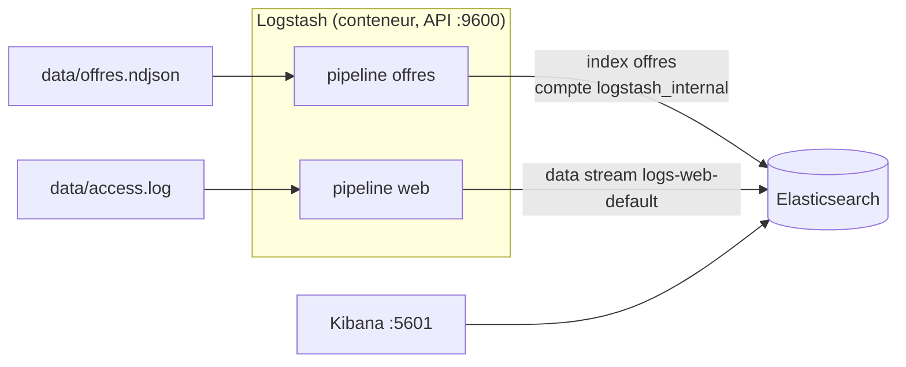

# TP — Ingestion et analyse de logs avec Logstash (EISI, 1 jour)

## Présentation

En 7 h, les apprenants ajoutent Logstash à la stack du TP d'introduction. Ils l'utilisent d'abord pour recharger les 5 000 offres d'emploi, puis pour transformer les logs d'accès du site de recrutement en événements structurés. Ils mènent ensuite une enquête dans Kibana et livrent un tableau de bord.

**Public :** EISI Data.
**Prérequis :** TP « Introduction à Elasticsearch » terminé : stack Docker fonctionnelle et index `offres` créé avec son mapping strict (TP d'introduction, ex. 1.4 et partie 2).
**Référence :** support de cours ELK, sections 13 à 15 (logs, Logstash, data streams).

**Rendu :** on continue dans le **dépôt GitHub personnel** du TP d'introduction. Committez après chaque partie ; le lien du dépôt est transmis au formateur en fin de journée. Contenu attendu : voir « Livrables » en fin de document.

**Contexte.** Le site de recrutement qui publie les offres du TP d'introduction a deux demandes :
1. remplacer le script maison `ingest.py` par un outil d'ingestion standard, supervisable et robuste ;
2. exploiter ses **logs d'accès web** pour comprendre son trafic. L'équipe d'exploitation signale un incident survenu la semaine passée, et l'équipe sécurité soupçonne une activité suspecte.

**Objectifs — à la fin du TP, l'apprenant sait :**

1. Ajouter Logstash à une stack Docker et le connecter à Elasticsearch avec un compte à moindres privilèges.
2. Écrire, tester et superviser un pipeline `input → filter → output`.
3. Structurer une ligne de log avec `grok`, la dater avec `date`, l'enrichir avec `useragent`, au format ECS.
4. Choisir entre un index (entités) et un data stream (événements).
5. Rendre une ingestion idempotente et diagnostiquer un document rejeté (*dead letter queue*).
6. Enquêter dans Discover avec KQL et ES|QL, puis construire un tableau de bord Lens.

**Déroulé**

| Horaire | Séquence | Livrable |
| --- | --- | --- |
| 09:00–09:45 | Mise en place : compte Logstash, premier pipeline (exercice 0) | `requetes/logstash.txt` |
| 09:45–10:45 | Partie 1 — Recharger les offres avec Logstash | `logstash/pipeline/offres.conf` |
| 10:45–11:00 | Pause | — |
| 11:00–12:30 | Partie 2 — Superviser et fiabiliser | `REPONSES.md` |
| 13:30–15:00 | Partie 3 — Transformer les logs d'accès | `logstash/pipeline/web.conf` |
| 15:00–15:15 | Pause | — |
| 15:15–16:15 | Partie 4 — Enquête dans Kibana | `requetes/enquete.txt`, `REPONSES.md` |
| 16:15–17:00 | Partie 5 — Tableau de bord et restitution | Capture du tableau de bord |

**Versions utilisées (vérifiées le 27/09/2026)**

| Composant | Version | Remarque |
| --- | --- | --- |
| Elasticsearch, Kibana | 9.5.4 | Stack du TP d'introduction, inchangée |
| [Logstash](https://github.com/elastic/logstash/releases) | 9.5.4 | Image `docker.elastic.co/logstash/logstash:9.5.4` ; même version que le cluster, obligatoire |
| Python | 3.12 ou plus récent | Uniquement pour générer les logs |
| Docker Compose | v2 | Profils de service (`profiles`) |

## Logstash en bref

Logstash est un moteur de traitement de **flux d'événements** : il lit des données depuis des sources (fichiers, bases, files de messages, agents), les transforme, puis les envoie vers une ou plusieurs destinations. Un **événement** est un ensemble de champs ; il possède toujours un champ `@timestamp`.

Un **pipeline** Logstash enchaîne trois sections, exécutées dans l'ordre :

```text
input { … }     # lire : file, beats, kafka, jdbc, stdin…
filter { … }    # transformer : grok, date, mutate, useragent…
output { … }    # envoyer : elasticsearch, stdout, kafka…
```

**Architecture du TP**



Les deux pipelines tournent dans le **même** Logstash mais sont isolés : chacun a ses entrées, ses filtres, ses sorties et ses compteurs.

**Glossaire du TP** (en complément de celui du TP d'introduction et du support de cours)

| Terme | Définition |
| --- | --- |
| Codec | Décode ou encode un format à l'entrée ou à la sortie (`json`, `plain`, `rubydebug`) |
| Data stream | Nom logique pour des événements horodatés, en ajout seul, stockés dans une suite d'index cachés (*backing indices*) |
| Dead letter queue (DLQ) | File sur disque où Logstash range les documents refusés par Elasticsearch |
| ECS | Elastic Common Schema : noms de champs communs (`source.address`, `http.response.status_code`…) |
| Grok | Filtre qui découpe un texte en champs à l'aide de motifs nommés (`%{COMBINEDAPACHELOG}`) |
| Sincedb | Fichier où l'entrée `file` mémorise jusqu'où elle a lu chaque fichier |

## Mise en place (45 min, exercice 0 compris)

Objectif : un service Logstash qui démarre avec la stack du TP d'introduction et s'authentifie avec un compte dédié.

**Contenu du kit**

| Fichier | Rôle |
| --- | --- |
| `docker-compose.override.yml` | Ajoute le service `logstash` ; fusionné automatiquement avec `docker-compose.yml` par Docker Compose |
| `logstash/config/pipelines.yml` | Déclare deux pipelines isolés : `offres` et `web` |
| `logstash/pipeline/offres.conf` | Squelette à compléter (partie 1) |
| `logstash/pipeline/web.conf` | Squelette à compléter (partie 3) |
| `data/generate_access_logs.py` | Génère 7 jours de logs d'accès, déterministe (`--seed 42`) |

Copiez le contenu du kit **à la racine du dépôt du TP d'introduction** (à côté de `docker-compose.yml`).

**Étapes**

1. Ajouter au fichier `.env` le mot de passe du futur compte Logstash :

```bash
python -c "import secrets; print(secrets.token_urlsafe(16))"
# puis dans .env : LOGSTASH_INTERNAL_PASSWORD=<valeur générée>
```

2. Vérifier que la stack du TP d'introduction tourne et que l'index `offres` existe :

```bash
docker compose up -d
docker compose ps                    # elasticsearch et kibana "healthy"
```

```text
GET offres/_count                    # attendu : 5000
```

3. Dans Kibana Dev Tools, créer un rôle limité aux besoins de Logstash, puis l'utilisateur qui le porte (même mot de passe que dans `.env`) :

```text
POST _security/role/logstash_writer
{
  "cluster": ["monitor", "manage_index_templates"],
  "indices": [
    { "names": ["offres", "logs-web-*"],
      "privileges": ["write", "create", "create_index", "auto_configure"] }
  ]
}

POST _security/user/logstash_internal
{ "password": "<LOGSTASH_INTERNAL_PASSWORD>", "roles": ["logstash_writer"],
  "full_name": "Logstash - ingestion" }
```

Enregistrez ces requêtes dans `requetes/logstash.txt`, **sans** le mot de passe.

4. Observer le service ajouté : il est rattaché au **profil** Compose `logstash`, donc `docker compose up -d` ne le démarre pas ; il faut le nommer (`docker compose up -d logstash`).

**Questions :** pourquoi ne pas utiliser le compte `elastic` pour Logstash ? Que se passerait-il si le pipeline `web` tentait d'écrire dans `logs-generic-default` ? Pourquoi le mot de passe est-il transmis par variable d'environnement plutôt qu'écrit dans les fichiers `.conf` ?

### Exercice 0 — Premier pipeline (15 min)

Lancez un Logstash éphémère qui lit le clavier et affiche chaque événement :

```bash
docker compose run --rm --no-deps logstash --path.data /tmp/essai \
  -e 'input { stdin { } } output { stdout { codec => rubydebug } }'
```

Attendez le message indiquant que le pipeline tourne (environ 30 s), tapez une phrase puis Entrée. Recommencez avec deux ou trois phrases, puis quittez avec `Ctrl+C`.

Modifiez ensuite la commande pour ajouter un filtre qui met le message en majuscules :

```text
filter { mutate { uppercase => ["message"] } }
```

**Questions :** quels champs Logstash a-t-il ajoutés à votre phrase ? Que contient `@timestamp` : l'heure de quoi ? À quoi sert l'option `--path.data /tmp/essai` (indice : un autre Logstash pourrait utiliser le même dossier de données) ?

## Partie 1 — Recharger les offres avec Logstash (1 h)

Objectif : remplacer `ingest.py` par le pipeline `offres`, avec le même résultat : 5 000 documents dans l'index `offres`, sans doublon.

### Notions clés

**L'entrée `file`** lit des fichiers du disque. Elle a deux modes :

| Mode | Comportement | Usage |
| --- | --- | --- |
| `tail` (défaut) | Suit la fin du fichier et attend les nouvelles lignes | Logs écrits en continu |
| `read` | Lit chaque fichier en entier, une fois | Fichiers complets déposés dans un dossier |

Elle mémorise sa position dans un fichier **sincedb**, pour reprendre après un redémarrage. En laboratoire, `sincedb_path => "/dev/null"` désactive cette mémoire : le fichier est relu à chaque démarrage.

> Attention : en mode `read`, l'action par défaut après lecture (`file_completed_action`) est **`delete`** : le fichier source est supprimé. On la remplace par `log`, qui se contente de noter le nom du fichier lu.

**Le codec `json`** transforme chaque ligne en événement dont les champs sont ceux de l'objet JSON.

**La sortie `elasticsearch`** envoie les événements par lots via l'API `_bulk`, comme `helpers.bulk` dans le TP d'introduction. Réglages utiles :

| Réglage | Rôle |
| --- | --- |
| `index` | Index cible |
| `document_id` | `_id` du document ; `"%{id}"` insère la valeur du champ `id` |
| `data_stream` | `"true"`, `"false"` ou `"auto"` : écrire ou non dans un data stream |
| `manage_template` | Installer ou non un modèle d'index ; inutile ici, le mapping existe déjà |

**Mode ECS.** Depuis la version 8, Logstash nomme les champs qu'il ajoute selon ECS. L'entrée `file` ajoute par exemple `log.file.path`, `host.name`, `event.original`, en plus de `@timestamp` et `@version` présents sur tout événement.

### Exercice 1.1 — Compléter `offres.conf`

Traitez les `TODO` 1 à 5 de `logstash/pipeline/offres.conf`. Laissez le `TODO` 6 pour l'exercice 1.3. Documentation : [entrée file](https://www.elastic.co/docs/reference/logstash/plugins/plugins-inputs-file), [sortie elasticsearch](https://www.elastic.co/docs/reference/logstash/plugins/plugins-outputs-elasticsearch).

Vérifiez la syntaxe sans rien exécuter :

```bash
docker compose run --rm --no-deps logstash --path.data /tmp/test \
  --config.test_and_exit -f /usr/share/logstash/pipeline/offres.conf
# attendu : "Config Validation Result: OK"
```

### Exercice 1.2 — Premier lancement

Relevez d'abord le `_version` actuel d'une offre :

```text
GET offres/_doc/OFF-00002
```

Puis démarrez Logstash et suivez ses journaux :

```bash
docker compose up -d logstash
docker compose logs -f logstash
```

**Questions :** les documents sont-ils indexés ? Quelle erreur Elasticsearch renvoie-t-il, avec quel code HTTP et quel type d'exception ? Quels noms de champs sont cités ? Faites le lien avec `"dynamic": "strict"` (TP d'introduction, ex. 1.4).

### Exercice 1.3 — Corriger

Traitez le `TODO` 6 : supprimez, avec le filtre `mutate`, les champs ajoutés par Logstash que le mapping de `offres` n'accepte pas. Vérifiez la syntaxe, puis redémarrez :

```bash
docker compose restart logstash
docker compose logs -f logstash       # plus d'erreur d'indexation
```

```text
GET offres/_count
GET offres/_doc/OFF-00002
```

**Questions :** le nombre de documents a-t-il changé ? Et le `_version` de `OFF-00002` ? Pourquoi ? Pourquoi a-t-on préféré supprimer ces champs plutôt que d'assouplir le mapping de l'index ? Pourquoi l'index `offres` doit-il exister **avant** le premier démarrage de Logstash (indice : `manage_template => false` et mapping dynamique) ?

### Exercice 1.4 — Relancer

Redémarrez encore une fois Logstash et relisez `_count` et `_version`.

**Questions :** combien de fois le fichier a-t-il été lu ? Que se passerait-il avec la sincedb par défaut au lieu de `/dev/null` ? Et si `document_id` n'était pas renseigné ?

## Partie 2 — Superviser et fiabiliser (1 h 30)

Objectif : savoir ce que fait Logstash, isoler les documents en erreur et comprendre pourquoi les pipelines sont séparés.

### Notions clés

**L'API de supervision** de Logstash (port 9600) donne, par pipeline et par plugin, le nombre d'événements reçus (`in`), filtrés (`filtered`), envoyés (`out`) et le temps passé.

**La file d'attente** entre entrées et filtres est en mémoire par défaut : rapide, mais son contenu est perdu en cas d'arrêt brutal. Une file **persistée** (`queue.type: persisted`) est écrite sur disque et survit au redémarrage. La garantie devient alors « au moins une fois » : un `_id` métier neutralise les doublons éventuels.

**La dead letter queue (DLQ).** Quand Elasticsearch refuse un document pour une raison qui ne se réglera pas en réessayant (erreur de mapping, code 400 ou 404), Logstash le **perd** par défaut, en laissant seulement une trace dans son journal. Avec la DLQ activée, il le range dans une file sur disque, avec la raison du refus. L'entrée `dead_letter_queue` permet ensuite de relire ces documents pour les analyser, les corriger et les réinjecter.

**Plusieurs pipelines.** Sans `pipelines.yml`, l'image Docker charge **tous** les fichiers du dossier `pipeline/` dans un seul pipeline `main` : les fichiers sont concaténés, et chaque entrée alimente chaque sortie. `pipelines.yml` déclare des pipelines isolés.

### Exercice 2.1 — Superviser

```bash
curl -s "http://localhost:9600/?pretty"
curl -s "http://localhost:9600/_node/pipelines?pretty"
curl -s "http://localhost:9600/_node/stats/pipelines/offres?pretty"
```

**Questions :** combien de pipelines sont chargés, avec combien de *workers* chacun ? Que valent `in`, `filtered` et `out` pour `offres`, et que représentent-ils depuis le dernier démarrage ? Quel plugin du pipeline consomme le plus de temps (`duration_in_millis`) ?

### Exercice 2.2 — Isoler les documents rejetés

1. Dans `docker-compose.override.yml`, décommentez `DEAD_LETTER_QUEUE_ENABLE=true`, puis recréez le conteneur : `docker compose up -d logstash`.
2. Créez `data/offres_test.ndjson` avec **une seule ligne** : copie de la dernière ligne de `data/offres.ndjson`, `id` changé en `OFF-99999`, et un champ `"prime": 3000` ajouté (comme dans le TP d'introduction, ex. 2.3).
3. Redémarrez Logstash : le motif `path => "/data/offres*.ndjson"` lit aussi ce nouveau fichier.

```bash
docker compose restart logstash
docker compose logs logstash | grep -i "dead letter\|could not index"
docker compose exec logstash ls -lR /usr/share/logstash/data/dead_letter_queue
```

```text
GET offres/_doc/OFF-99999
GET offres/_count
```

4. Relisez le contenu de la DLQ avec un second Logstash éphémère, lancé **dans** le conteneur (quittez avec `Ctrl+C`) :

```bash
docker compose exec logstash logstash --path.data /tmp/dlq -e '
input { dead_letter_queue {
  path => "/usr/share/logstash/data/dead_letter_queue"
  pipeline_id => "offres"
  commit_offsets => false } }
output { stdout { codec => rubydebug { metadata => true } } }'
```

**Questions :** le document `OFF-99999` est-il dans l'index ? Où se trouve-t-il ? Quelle raison de refus est enregistrée dans `[@metadata][dead_letter_queue]` ? Comparez avec `raise_on_error=False` dans `ingest.py` : qu'apporte la DLQ en plus ? Décrivez en trois étapes comment vous corrigeriez et réinjecteriez ce document.

Supprimez ensuite `data/offres_test.ndjson`.

### Exercice 2.3 — Pourquoi deux pipelines ?

Relisez `logstash/config/pipelines.yml` et la sortie de l'exercice 2.1.

**Questions :** si ce fichier n'était pas monté, combien de pipelines Logstash chargerait-il ? Dans ce cas, que deviendrait une offre lue dans `offres.ndjson` : dans quelle(s) destination(s) serait-elle envoyée ? Et une ligne de log d'accès ? Citez deux autres avantages à isoler les pipelines.

### Exercice 2.4 — Ne rien perdre (réflexion)

**Questions :** Logstash est arrêté brutalement (`docker kill`) pendant la lecture d'un gros fichier. Avec la file en mémoire, que deviennent les événements lus mais pas encore envoyés ? Quel réglage change ce comportement, et quelle garantie obtient-on ? Pourquoi le `document_id` de la partie 1 devient-il alors indispensable ?

## Partie 3 — Transformer les logs d'accès (1 h 30)

Objectif : transformer chaque ligne de log en un événement structuré, correctement daté, au format ECS, stocké dans le data stream `logs-web-default`.

### Le jeu de données : 7 jours de logs d'accès

`data/generate_access_logs.py` produit `data/access.log` : les requêtes HTTP reçues par le site de recrutement **du 23/09/2026 au 29/09/2026 inclus**, au format Apache *combined*. Le fichier est identique pour tous (`--seed 42`) et contient **20 700 lignes**. Les adresses IP appartiennent aux plages réservées à la documentation (RFC 5737). Le trafic comprend :

- des consultations de la page d'accueil, de recherches (`/recherche?q=…`) et d'offres (`/offres/OFF-01468`) ;
- des candidatures (`POST /offres/OFF-…/postuler`) et des appels à l'API (`/api/offres?…`) ;
- des fichiers statiques ;
- **des anomalies**, que vous devrez retrouver à la partie 4.

Exemple de ligne :

```text
203.0.113.123 - - [23/Sep/2026:00:00:39 +0200] "GET /offres/OFF-01468 HTTP/1.1" 200 43686 "https://jobs.example.org/recherche" "Mozilla/5.0 (Linux; Android 15; Pixel 9) AppleWebKit/537.36 (KHTML, like Gecko) Chrome/140.0.0.0 Mobile Safari/537.36"
```

| Élément | Exemple | Champ ECS visé |
| --- | --- | --- |
| Adresse du client | `203.0.113.123` | `source.address` |
| Date et heure | `23/Sep/2026:00:00:39 +0200` | `@timestamp` |
| Méthode | `GET` | `http.request.method` |
| URL | `/offres/OFF-01468` | `url.original` |
| Version HTTP | `1.1` | `http.version` |
| Code de réponse | `200` | `http.response.status_code` |
| Taille de la réponse | `43686` | `http.response.body.bytes` |
| Page d'origine | `https://jobs.example.org/recherche` | `http.request.referrer` |
| Navigateur | `Mozilla/5.0 (Linux; Android 15…` | `user_agent.original` |

### Notions clés

**`grok`** extrait des champs d'un texte avec des motifs nommés, `%{MOTIF:champ}`. Le motif prédéfini `%{COMBINEDAPACHELOG}` reconnaît le format ci-dessus et produit les champs ECS du tableau, sauf `@timestamp` : la date est extraite dans un champ texte `timestamp`. Une ligne non reconnue reçoit l'étiquette `_grokparsefailure`. Des motifs personnalisés se déclarent avec `pattern_definitions`.

**`date`** analyse un champ texte selon un format et écrit le résultat dans `@timestamp`. Sans lui, `@timestamp` est l'heure de **lecture** par Logstash : tous les événements sembleraient s'être produits à la même minute. Les mois étant en anglais (`Sep`), on fixe `locale => "en"`.

**`useragent`** décompose la chaîne du navigateur en nom, version, système d'exploitation et type d'appareil (`user_agent.name`, `user_agent.os.name`, `user_agent.device.name`).

**Conditions.** Un filtre peut être appliqué sous condition :

```text
if [url][original] =~ /^\/offres\// { … }
if "_grokparsefailure" not in [tags] { … }
```

**Data stream.** Les logs sont des événements horodatés, écrits une fois et jamais modifiés : on les range dans un **data stream** nommé `<type>-<dataset>-<namespace>`, ici `logs-web-default`. Elasticsearch fournit un modèle pour `logs-*-*` : écrire dans ce nom crée automatiquement le data stream, avec des mappings ECS, un cycle de vie et, depuis la 9.0, le mode de stockage compact `logsdb`.

### Exercice 3.1 — Générer les logs

```bash
python data/generate_access_logs.py        # → data/access.log, 20700 lignes
head -3 data/access.log
```

Le pipeline `web` surveille `/data/access.log` : il commence à le lire dès qu'il apparaît. Tant que `web.conf` n'est pas complété, **arrêtez Logstash** (`docker compose stop logstash`) pour ne pas envoyer des événements bruts.

### Exercice 3.2 — Mettre au point le motif

Dans Kibana, **Dev Tools → Grok Debugger** : collez une ligne de `access.log` dans *Sample Data* et `%{COMBINEDAPACHELOG}` dans *Grok Pattern*, puis *Simulate*.

**Questions :** quels champs sont extraits ? Sous quel type apparaît `http.response.status_code` ? Pourquoi `timestamp` doit-il encore être traité ? Écrivez et testez un motif qui extrait `OFF-01468` de l'URL `/offres/OFF-01468/postuler`.

### Exercice 3.3 — Compléter `web.conf`

Traitez les `TODO` 1 à 6 de `logstash/pipeline/web.conf`. Documentation : [grok](https://www.elastic.co/docs/reference/logstash/plugins/plugins-filters-grok), [date](https://www.elastic.co/docs/reference/logstash/plugins/plugins-filters-date), [useragent](https://www.elastic.co/docs/reference/logstash/plugins/plugins-filters-useragent), options `data_stream_*` de la [sortie elasticsearch](https://www.elastic.co/docs/reference/logstash/plugins/plugins-outputs-elasticsearch).

```bash
docker compose run --rm --no-deps logstash --path.data /tmp/test \
  --config.test_and_exit -f /usr/share/logstash/pipeline/web.conf
docker compose up -d logstash
docker compose logs -f logstash
```

### Exercice 3.4 — Vérifier le data stream

```text
GET _data_stream/logs-web-default
GET logs-web-default/_count
GET logs-web-default/_count
{ "query": { "term": { "tags": "_grokparsefailure" } } }
GET logs-web-default/_search
{ "size": 1, "sort": [{ "@timestamp": "asc" }] }
GET logs-web-default/_mapping/field/http.response.status_code
GET logs-web-default/_settings?filter_path=*.settings.index.mode
```

**Questions :** combien de documents (attendu : 20 700) et combien d'échecs de `grok` (attendu : 0) ? Quel est le nom de l'index caché (*backing index*) qui contient les données, et que signifie chaque partie de ce nom ? Le premier événement est-il daté du 23/09/2026 à 00:00:39 (+02:00), soit 22:00:39 UTC la veille ? Quel type a reçu `http.response.status_code`, et pourquoi est-ce important pour la suite ? Quel `index.mode` est utilisé ?

### Exercice 3.5 — Rejouer sans doublon ?

Redémarrez Logstash, attendez la fin de la lecture, puis relisez `logs-web-default/_count`.

**Questions :** que constatez-vous, et pourquoi le problème ne se posait-il pas pour `offres` ? Peut-on mettre à jour ou remplacer un document dans un data stream ? Proposez deux solutions pour pouvoir rejouer ce fichier sans doublon (indice : sincedb, et un `_id` calculé à partir du contenu de la ligne avec le filtre [`fingerprint`](https://www.elastic.co/docs/reference/logstash/plugins/plugins-filters-fingerprint)).

Pour repartir d'un état propre : `docker compose stop logstash`, puis `DELETE _data_stream/logs-web-default` dans Dev Tools, puis `docker compose up -d logstash`.

## Partie 4 — Enquête dans Kibana (1 h)

Objectif : répondre à des questions d'exploitation et de sécurité à partir des logs, avec Discover. Enregistrez vos requêtes KQL et ES|QL dans `requetes/enquete.txt` et vos réponses argumentées dans `REPONSES.md`.

### Notions clés

**Data view.** Créez une *data view* **Logs web** sur le motif `logs-web-*`, champ temporel `@timestamp` (Stack Management → Data Views).

**Période.** Les logs couvrent le **23/09/2026 au 30/09/2026** : dans le sélecteur de période de Discover, choisissez des dates **absolues** (*Absolute*), sinon « Last 15 minutes » n'affiche rien. Kibana affiche les heures dans le fuseau du navigateur.

**Deux langages dans Discover :**

| | KQL | ES\|QL |
| --- | --- | --- |
| Produit | Un filtre sur les documents | Un tableau de résultats calculés |
| Exemple | `http.response.status_code >= 500` | `FROM logs-web-default \| STATS n = COUNT(*) BY http.response.status_code` |
| Idéal pour | Filtrer, explorer les documents | Compter, regrouper, classer |

Exemple ES|QL, à adapter :

```text
FROM logs-web-default
| WHERE http.response.status_code >= 500
| STATS erreurs = COUNT(*) BY heure = BUCKET(@timestamp, 1 hour)
| SORT erreurs DESC
| LIMIT 10
```

### Exercice 4.1 — Vue d'ensemble

Quelle est la répartition des requêtes par code HTTP ? Par méthode ? Quel est le volume moyen de requêtes par jour ?

### Exercice 4.2 — L'incident

L'équipe d'exploitation signale des erreurs serveur « un après-midi de la semaine passée ». Retrouvez :

1. le jour et le créneau précis de l'incident (resserrez progressivement : pas d'une heure, puis de 5 minutes) ;
2. les URL touchées, et celles qui ne l'ont pas été ;
3. le nombre de réponses en erreur et la durée de l'incident ;
4. le comportement des clients pendant l'incident : le volume de requêtes sur les URL touchées a-t-il changé ? Proposez une explication.

### Exercice 4.3 — L'activité suspecte

L'équipe sécurité soupçonne un robot. Retrouvez :

1. l'adresse IP à l'origine d'une rafale de réponses 404 ;
2. le moment et la durée de cette activité ;
3. les URL demandées : que cherchait ce robot ?
4. son `user_agent.original` : comment le distinguer d'un navigateur ?

Toutes les 404 ne viennent pas de ce robot : d'où viennent les autres, et sont-elles inquiétantes ?

### Exercice 4.4 — Les offres les plus consultées

Quelles sont les 10 offres les plus consultées (`labels.offre_id`, requêtes `GET` avec code 200) ? Retrouvez leur titre, leur ville et leur contrat dans l'index `offres` avec une seule requête Dev Tools (indice : requête `ids` ou `terms`, TP d'introduction, partie 3).

### Exercice 4.5 — Le public

Quelle part du trafic provient d'appareils mobiles (`user_agent.os.name`) ? Quels sont les trois navigateurs les plus utilisés (`user_agent.name`) ?

## Partie 5 — Tableau de bord (45 min, restitution comprise)

Construisez avec Lens le tableau de bord **« Site de recrutement — trafic »** sur la data view *Logs web* :

| Panneau | Type | Contenu |
| --- | --- | --- |
| Requêtes | Indicateur | Nombre de requêtes sur la période |
| Taux d'erreur serveur | Indicateur | Formule : `count(kql='http.response.status_code >= 500') / count()`, format pourcentage |
| Trafic dans le temps | Barres empilées | `@timestamp` en abscisse, ventilé par `http.response.status_code` |
| Offres les plus consultées | Tableau | Top 10 de `labels.offre_id` |
| Navigateurs | Anneau | Top 5 de `user_agent.name` |
| Offres par ville | Carte (Maps) | Data view `offres`, champ `localisation` |

Vérifiez l'interactivité : un clic sur une barre de code `503` doit filtrer tout le tableau de bord.

**Bonus :** créez une règle d'alerte qui se déclenche quand plus de 50 réponses 5xx sont enregistrées en 5 minutes (Stack Management → Alerts and Insights → Rules), avec le connecteur *Server log*. Ses vérifications portent sur la période récente : elle ne se déclenchera pas sur ces logs datés du passé. Expliquez pourquoi, et comment vous la testeriez.

**Restitution (10 min par binôme ou volontaire) :** présentez votre tableau de bord et le rapport d'incident de l'exercice 4.2 comme à une équipe d'exploitation : ce qui s'est passé, quand, avec quel impact.

## Livrables, évaluation et sources

### Livrables

Dans le dépôt GitHub personnel du TP d'introduction :

- `docker-compose.override.yml` et `logstash/config/pipelines.yml` ;
- `logstash/pipeline/offres.conf` et `logstash/pipeline/web.conf` complétés ;
- `requetes/logstash.txt` (mise en place, sans mot de passe) et `requetes/enquete.txt` ;
- `REPONSES.md` : réponses aux questions et rapport d'enquête (parties 4 et 5) ;
- `captures/tableau-de-bord.png`.

Le fichier `.env` ne doit pas être versionné ; `data/access.log` non plus (il se régénère).

### Barème (/20)

| Critère | Points |
| --- | --- |
| Mise en place : rôle à moindres privilèges, secret hors du code | 2 |
| `offres.conf` : entrée `file` sûre, `_id` métier, champs parasites supprimés ; idempotence expliquée | 4 |
| Partie 2 : supervision, DLQ mise en œuvre et expliquée, rôle de `pipelines.yml` | 3 |
| `web.conf` : `grok`, `date`, `useragent`, identifiant d'offre, data stream ; vérifications de l'exercice 3.4 | 5 |
| Partie 4 : incident et activité suspecte correctement caractérisés, requêtes fournies | 4 |
| Partie 5 : tableau de bord complet et restitution | 2 |
| Pénalité : secret versionné dans Git | −2 |

### Sources

- [Logstash — releases GitHub](https://github.com/elastic/logstash/releases) (9.5.4) et [changements incompatibles 9.x](https://www.elastic.co/docs/release-notes/logstash/breaking-changes)
- [Logstash — configuration sous Docker](https://www.elastic.co/docs/reference/logstash/docker-config) (variables d'environnement, `pipelines.yml`)
- [Logstash — sécuriser la connexion à Elasticsearch](https://www.elastic.co/docs/reference/logstash/secure-connection) (rôle `logstash_writer`)
- Plugins : [entrée file](https://www.elastic.co/docs/reference/logstash/plugins/plugins-inputs-file), [entrée dead_letter_queue](https://www.elastic.co/docs/reference/logstash/plugins/plugins-inputs-dead_letter_queue), [filtre grok](https://www.elastic.co/docs/reference/logstash/plugins/plugins-filters-grok), [filtre date](https://www.elastic.co/docs/reference/logstash/plugins/plugins-filters-date), [filtre useragent](https://www.elastic.co/docs/reference/logstash/plugins/plugins-filters-useragent), [sortie elasticsearch](https://www.elastic.co/docs/reference/logstash/plugins/plugins-outputs-elasticsearch)
- [Motifs grok ECS](https://github.com/logstash-plugins/logstash-patterns-core/tree/main/patterns/ecs-v1) (`COMBINEDAPACHELOG`)
- [ECS — Elastic Common Schema](https://www.elastic.co/docs/reference/ecs)
- [Elasticsearch — data streams de logs et mode logsdb](https://www.elastic.co/docs/manage-data/data-store/data-streams/logs-data-stream)
